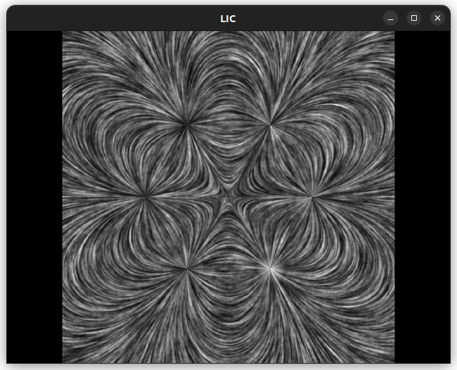

# Line Integral Convolution

 

### [Launch](https://thenumbernine.github.io/glapp/?dir=line-integral-convolution&file=run.lua)

Runs in LuaJIT

Uses my 
- lua-ext
- matrix-lua
- gl-lua
- cl-lua seems to have a number-to-glsl function that i'm too lazy to move out of it to somewhere like lua-ext or gl so meh 
- image-lua
- imgui-lua
